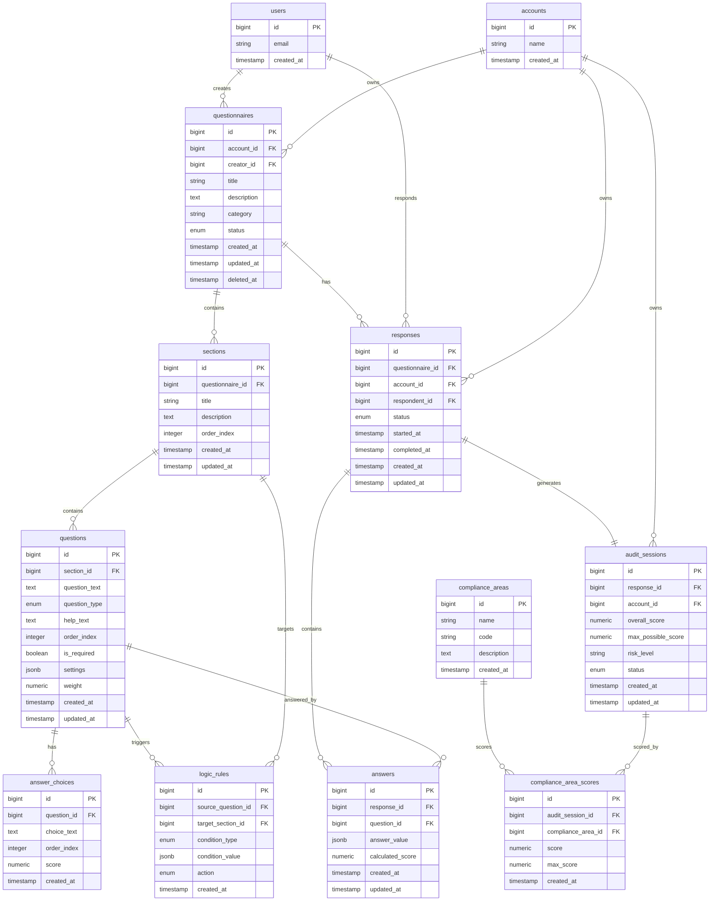

# Database Schema ERD

## Entity Relationship Diagram

## Table Groups

### Core Questionnaire Structure
- **questionnaires** - Main questionnaire definitions
- **sections** - Organizational sections within questionnaires
- **questions** - Individual questions
- **answer_choices** - Predefined choices for multiple/single choice questions
- **logic_rules** - Conditional branching logic

### Response Collection
- **responses** - User submission sessions
- **answers** - Individual question answers (JSONB for flexibility)

### Audit & Compliance
- **audit_sessions** - Compiled audit results with scoring
- **compliance_areas** - GDPR articles and principles (global reference data)
- **compliance_area_scores** - Detailed compliance breakdown per audit

### Multi-Tenancy
- **accounts** - Tenant isolation (from Jumpstart Pro)
- **users** - User accounts (from Jumpstart Pro)

## Key Design Decisions

1. **Multi-tenant Architecture**: All user data scoped to `account_id`
2. **Flexible Storage**: JSONB for `answer_value`, `settings`, `condition_value`
3. **Soft Deletes**: `deleted_at` on questionnaires only (MVP scope)
4. **Cascade Deletes**: Child records deleted when parent is removed
5. **Audit Trail**: `created_at`/`updated_at` timestamps with triggers
6. **Global Reference Data**: `compliance_areas` shared across all tenants

## Enum Types

- `questionnaire_status`: draft, published, archived
- `question_type`: single_choice, multiple_choice, text_short, text_long, yes_no, rating_scale
- `logic_condition_type`: equals, not_equals, contains, greater_than, less_than
- `logic_action`: show, hide, skip_to_section
- `response_status`: in_progress, completed
- `audit_status`: draft, completed
